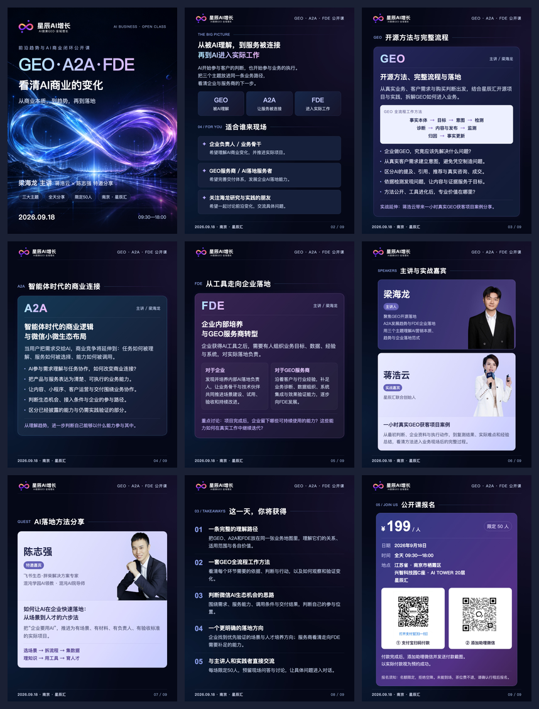
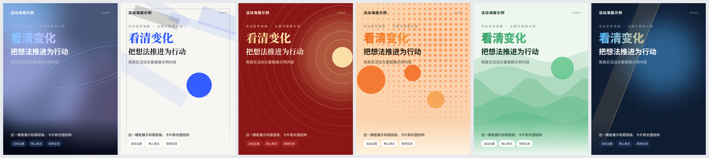

# 爆款海报生成器

**把文案和素材交给 AI，制作长图海报、单页海报和多张组图，还能接着改。**

星辰汇 · 星辰AI增长 开源项目 · 作者：allenlion · 版本：1.0 · [MIT 许可证](LICENSE) · [English](README.en.md)

适合做课程招生、活动报名、产品介绍、社群招募和内容分享。安装到支持技能的 AI 助手后，用日常语言说明需求、提供素材，由助手组织内容、排版并导出图片。

[快速安装](#快速安装) · [开始使用](#开始使用) · [效果示例](#效果示例) · [安装方式](#安装方式) · [常见问题](#常见问题) · [交流与反馈](#交流与反馈)

## 你会得到什么

| 想做什么 | 交付什么 |
| --- | --- |
| 公众号长图、活动详情长图 | 一张完整长图，JPG / PNG 格式 |
| 朋友圈、群公告单页海报 | 一张指定比例的海报，例如 3:4 或 9:16 |
| 多张内容卡片、9 张组图 | 按内容分页的编号图片、总览图和 ZIP 压缩包 |
| 改文字、换颜色、换照片 | 在原稿上继续修改，并保留可编辑的 HTML 源稿 |

这里的“9 张组图”指九张独立内容卡片，需要按文案规划九页；把一张大图切成 3×3 拼图暂不支持。

## 快速安装

**推荐：把下面这段话直接发给 Codex、Claude Code 等能读写文件、运行命令的 AI 助手。**

```text
帮我安装「爆款海报生成器」：
https://github.com/ALLENLION35/baokuan-poster-generator

请阅读 README，按当前应用支持的方式安装完整技能目录。
同时检查并准备图片导出环境：Node.js 22+、Python 3、npm 依赖、Chromium 和中文字体；已有可用环境就复用。
安装后确认能找到 baokuan-poster-generator，并运行内置示例，给我图片预览和文件位置。
```

看到示例长图和组图文件，才算完成了从安装到导出的检查。首次准备可能需要下载运行依赖和浏览器，耗时取决于网络与现有环境。

- [下载 1.0 完整技能包](https://github.com/ALLENLION35/baokuan-poster-generator/releases/download/v1.0.0/baokuan-poster-generator-1.0.0.zip)
- [查看 1.0 发布页](https://github.com/ALLENLION35/baokuan-poster-generator/releases/tag/v1.0.0)

只有文字聊天能力的应用无法运行本项目的图片导出脚本。请使用能执行命令、保存文件的环境；只上传 `SKILL.md` 不等于安装完整工具。

## 开始使用

安装后开启一个新会话，把文案和素材发给助手，再复制下面任意一种说法。

### 做一张长图

```text
使用爆款海报生成器，把附件里的活动文案做成公众号长图。
目标人群是企业负责人，整体简洁、有质感。
时间、地点、价格和报名方式都要保留，交付 JPG 和可修改源稿。
```

### 做一张单页海报

```text
使用爆款海报生成器，用附件里的文案、Logo 和产品图，做一张 3:4 朋友圈海报。
整体跟 Logo 的配色走，突出产品卖点和价格，底部放我提供的咨询二维码。
```

### 做 9 张内容组图

```text
使用爆款海报生成器，把这份内容整理成 9 张组图，每张 1080×1440。
第一页是封面，中间每页讲清一个主题，最后一页放总结和我提供的行动信息。
保持整组风格统一，保留关键事实；如果内容不足或太多，请说明怎样调整。
交付编号图片、总览和 ZIP。
```

### 继续修改

```text
在刚才那版上修改：标题更醒目，第二部分减少文字，整体换成暖色。
保留已确认的照片和活动信息，重新导出最新版。
```

同一会话可以接着修改。换会话时，把上次的 `poster.html` 一起提供，方便助手从最新版本继续。

## 需要准备什么

**先有文案就能开始，素材有就附上。**

| 资料 | 用来做什么 |
| --- | --- |
| 文案与投放场景 | 确定内容、信息顺序和海报比例 |
| Logo / 品牌色 | 统一配色与品牌呈现 |
| 人物、产品或场地照片 | 展示真实人物和产品；多人照片请注明对应姓名 |
| 报名或咨询二维码 | 放在行动区；没有就说明，不会编造替代码 |
| 喜欢的参考图 | 参考配色、排版和氛围，其中的人名、价格等不会作为你的活动资料 |

不确定风格时，说清受众和用途即可；也可以直接说“商务稳重”“温暖亲子”“极简留白”。

## 效果示例

以下展示星辰AI增长的「GEO · A2A · FDE：看清 AI 商业的变化」公开课活动海报，由项目维护者提供，包含九张组图总览和完整长图。

**九张组图总览**

[](examples/event-geo-a2a-fde-grid.png)

<details>
<summary>展开查看完整活动长图</summary>

[](examples/event-geo-a2a-fde-long.jpg)

</details>

点击图片可打开原图。活动信息以海报标注为准；案例素材说明见[素材来源](ASSET_SOURCES.md)。

<details>
<summary>展开查看六种配色风格</summary>



六种预设覆盖科技、极简、国潮、市集、自然和商务方向。有彩色 Logo 时，可以从品牌色派生配色；预设主要控制颜色与视觉气质。

</details>

## 安装方式

上面的“一句话安装”适合不想手动运行命令的用户。需要自行安装时，选择下面一种方式即可。

### 方式一：使用 skills 命令行

先准备 Node.js 22+ 和 npm，在终端执行：

```sh
npx skills add ALLENLION35/baokuan-poster-generator --skill baokuan-poster-generator
```

按提示选择目标 Agent。默认安装到当前项目；需要在多个项目中使用时，加 `--global`。参数说明见 [skills CLI 官方文档](https://github.com/vercel-labs/skills)。

**这一步只安装技能文件。** 安装后把快速安装中的环境准备与示例检查要求发给助手，或按下面的命令准备导出环境。

### 方式二：下载 ZIP 安装

下载上面的完整技能包，解压后得到 `baokuan-poster-generator/`。将整个目录交给助手安装，或按宿主的技能目录规则放置。保留 `SKILL.md`、`scripts/`、`assets/`、`themes/`、`references/` 和依赖清单等完整文件。

若应用提供技能包导入入口，可按该应用说明导入；是否能运行图片导出，仍取决于它是否支持所需运行环境。不同客户端尚未逐一验证。

### 手动准备导出环境

在**实际安装目录**（包含 `package.json` 的目录）打开终端，运行：

```sh
npm ci
npx playwright install chromium
npm run demo
python3 scripts/pack.py outputs/demo
```

需要 Node.js 22+、Python 3 和可用的中文字体。Linux 的浏览器系统依赖、Windows 的 Python 命令差异，以及重复运行示例的方法，见[命令行制作指南](docs/CLI.zh-CN.md#准备环境)。

成功后，目录里会有：

| 文件 | 查看什么 |
| --- | --- |
| `outputs/demo/poster.jpg` | 完整长图 |
| `outputs/demo/overview.png` | 组图总览 |
| `outputs/demo/slides.zip` | 可下载、可分享的小图压缩包 |

## 常见问题

**需要会写代码吗？** 通过支持命令执行的 AI 助手使用时，不需要手动改代码。把要求和素材说清楚，让助手完成安装、排版、导出和修改。

**为什么安装完还不能出图？** 技能文件和渲染环境是两部分。把报错交给助手，请它检查 Node.js、Python、npm 依赖、Chromium 和字体；安装章节提供了完整检查步骤。

**需要额外购买生图 API 吗？** 基础排版和导出不要求图片生成 API。没有背景素材时，可以生成程序化底图。AI 助手本身的费用按所用应用规则计算。

**为什么输出目录已存在时会报错？** 工具默认保留旧成品。让助手导出到新的版本目录即可；手动操作见[命令行指南](docs/CLI.zh-CN.md#先跑内置示例)。

**生成后能直接发布吗？** 请先看成品，核对文字、时间、价格、人物对应和二维码扫码结果。工具会检查图片加载、文字裁切等问题，视觉效果和事实仍需复核。

**会自动带项目二维码或水印吗？** 项目交流群二维码只用于开源文档，不会自动写进用户海报；活动二维码以你提供的素材为准。

## 进一步了解

- [命令行制作指南](docs/CLI.zh-CN.md)：主题、Logo 取色、源稿修改、分页方案和导出命令。
- [Skill 工作规则](SKILL.md)：助手怎样组织内容、选风格和交付。
- [版本记录](CHANGELOG.md) · [后续计划](ROADMAP.md) · [参与贡献](CONTRIBUTING.md) · [反馈问题](https://github.com/ALLENLION35/baokuan-poster-generator/issues)

1.0 已通过 macOS 本地与 [Ubuntu 云端的 35 项测试](https://github.com/ALLENLION35/baokuan-poster-generator/actions/runs/34823128808)。测试覆盖渲染、配色和底图管理，不代表每个客户端、每种文案的效果都已验证。

按 [MIT 许可证](LICENSE) 开源。素材记录见[素材来源](ASSET_SOURCES.md)，依赖说明见[第三方声明](THIRD_PARTY_NOTICES.md)，安全范围见[安全政策](SECURITY.md)。

## 交流与反馈

**星辰汇 · 星辰AI增长｜海报与 AI 增长交流群**

欢迎交流 AI 海报制作、内容创作与增长实践，也欢迎分享作品、提出问题与改进建议。

**扫码添加微信，申请入群。** 添加时可备注「爆款海报生成器」。


X 主页：[allenlion · @ALLENLION35](https://x.com/ALLENLION35)
